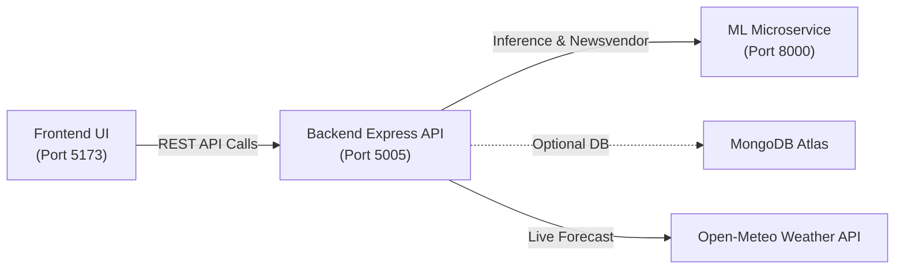

# Smart Canteen — Local Startup & Hosting Guide

This guide walks you through starting all three components of the **Smart Canteen Waste Management System** on your local machine (`localhost`).

---

## 🏗️ Architecture Overview

The system consists of three interconnected services:

| Component | Technology | Default Port | Local URL | Role |
| :--- | :--- | :--- | :--- | :--- |
| **1. ML Service** | Python (FastAPI, Uvicorn, XGBoost) | `8000` | [http://localhost:8000](http://localhost:8000) (Docs: [/docs](http://localhost:8000/docs)) | XGBoost demand prediction & Newsvendor safety buffer calculations |
| **2. Backend** | Node.js (Express, Mongoose) | `5005` | [http://localhost:5005](http://localhost:5005) (Health: [/api/ml-health](http://localhost:5005/api/ml-health)) | REST API gateway, weather integration (Open-Meteo), and data orchestration |
| **3. Frontend** | React 19 (Vite, Tailwind CSS, Recharts) | `5173` | [http://localhost:5173](http://localhost:5173) | Interactive Kitchen & Regional Operations dashboard |



---

## 📋 Prerequisites

Ensure the following runtimes are installed on your machine:

- **Node.js**: v18+ (tested on v24.18) — check with `node -v`
- **npm**: v9+ (tested on v11.16) — check with `npm -v`
- **Python**: 3.10+ (tested on 3.14) — check with `python --version`

---

## 🚀 How to Start the Services (Step-by-Step)

To host all three services, open **three separate terminal / PowerShell windows**:

### Terminal 1: Start ML Microservice (Python FastAPI)

1. Open PowerShell or Command Prompt.
2. Navigate to the `ml_service` directory:
   ```powershell
   cd ml_service
   ```
3. Install dependencies (only required the first time):
   ```powershell
   pip install -r requirements.txt
   ```
4. Start the FastAPI server:
   ```powershell
   python -m uvicorn main:app --host 127.0.0.1 --port 8000 --reload
   ```
5. **Verify**:
   - Terminal prints: `Application startup complete. Uvicorn running on http://127.0.0.1:8000`
   - Open [http://localhost:8000/health](http://localhost:8000/health) in your browser. It should return:
     ```json
     {"status": "healthy", "model_loaded": true, "rmse": 14.26}
     ```
   - Interactive Swagger API docs are available at [http://localhost:8000/docs](http://localhost:8000/docs).

---

### Terminal 2: Start Backend API Gateway (Node.js Express)

1. Open a **second** terminal window.
2. Navigate to the `backend` directory:
   ```powershell
   cd backend
   ```
3. Install dependencies (only required the first time):
   ```powershell
   npm install
   ```
4. Start the Express server:
   ```powershell
   npm start
   ```
5. **Verify**:
   - Terminal prints:
     ```text
     ℹ️ No MONGODB_URI found. Running in local operational mode (ML inference & weather active).
     Node.js API Gateway running on port 5005
     ```
     *(Note: MongoDB is optional; if no `MONGODB_URI` is provided, the backend operates in standalone local mode).*
   - Test connectivity between Backend and ML Service by opening [http://localhost:5005/api/ml-health](http://localhost:5005/api/ml-health). It should return:
     ```json
     {
       "connected": true,
       "status": "online",
       "serviceUrl": "http://127.0.0.1:8000",
       "modelName": "XGBoost v1.0 Regressor"
     }
     ```

---

### Terminal 3: Start Frontend Dashboard (React + Vite)

1. Open a **third** terminal window.
2. Navigate to the `frontend` directory:
   ```powershell
   cd frontend
   ```
3. Install dependencies (only required the first time):
   ```powershell
   npm install
   ```
4. Start the Vite development server:
   ```powershell
   npm run dev
   ```
5. **Verify**:
   - Terminal prints:
     ```text
     VITE v8.2.2  ready in ... ms
     ➜  Local:   http://localhost:5173/
     ```
   - Open [http://localhost:5173/](http://localhost:5173/) in your web browser.

---

## ⚡ Quick Start: One-Click Scripts

For convenience, you can also launch or stop all 3 services using helper scripts located in this folder:

### 1. Launch All (`start_all.bat`)
Double-click `start_all.bat` or run:
```cmd
.\start_all.bat
```
This opens 3 separate labeled command windows (ML Service, Backend, and Frontend) and automatically launches your default browser to [http://localhost:5173](http://localhost:5173).

### 2. Stop All (`stop_all.bat`)
To terminate all 3 services running on ports 8000, 5005, and 5173:
```cmd
.\stop_all.bat
```

---

## 🔍 Health Check & Testing Checklist

Once all services are running, verify each endpoint:

- [ ] **Frontend Application**: [http://localhost:5173](http://localhost:5173)
- [ ] **Backend ML Health**: [http://localhost:5005/api/ml-health](http://localhost:5005/api/ml-health)
- [ ] **Batch Cook Plan API**: [http://localhost:5005/api/batch-plan?district=amaravati](http://localhost:5005/api/batch-plan?district=amaravati)
- [ ] **Python ML Health Check**: [http://127.0.0.1:8000/health](http://127.0.0.1:8000/health)
- [ ] **FastAPI Swagger Docs**: [http://127.0.0.1:8000/docs](http://127.0.0.1:8000/docs)

---

## 🛠️ Troubleshooting & FAQs

### Port Already In Use
If a port (8000, 5005, or 5173) is occupied:
1. Find what is using the port in PowerShell:
   ```powershell
   Get-Process -Id (Get-NetTCPConnection -LocalPort 5005).OwningProcess
   ```
2. Or use the provided `stop_all.bat` script to free the ports.

### ML Service Offline Warning on Frontend
If the frontend indicates "ML Service Offline":
1. Check that Terminal 1 (Python) is active without errors.
2. Confirm `http://127.0.0.1:8000/health` returns `healthy`.
3. Check `backend/.env` contains `ML_SERVICE_URL=http://127.0.0.1:8000`.

### MongoDB Connection Message
- The backend logs `No MONGODB_URI found. Running in local operational mode`.
- **This is expected and normal**: the backend is designed to run locally even without a MongoDB database configured, using mock fallbacks and direct ML calculations for production-readiness.
